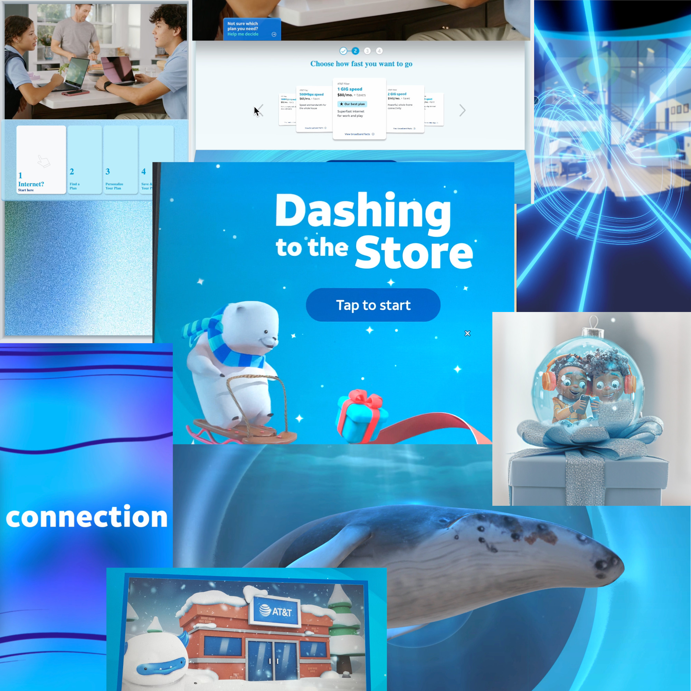
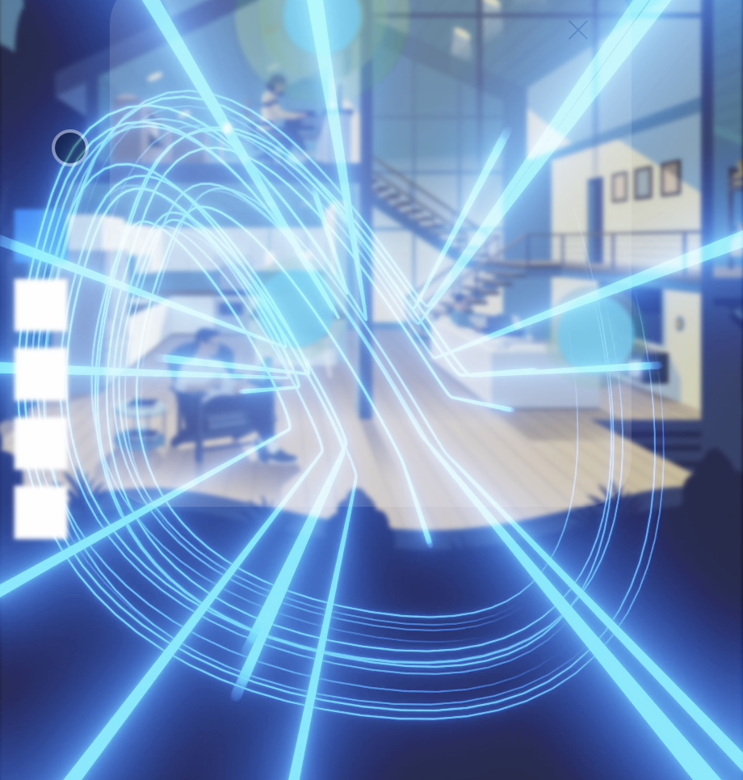

Since 2022, I've been working as a Creative Technologist at TPN on the AT&T account. This work as led me to wear many hats and be exposed a wide range of projects featured across the nationwide AT&T retail fleet.

My contributions include rapid prototyping, technology R&D, interfacing between internal teams, and design explorations at the edge of brand guidelines.

Some of my proudest contributions:
* UX, prototyping, and look-development for a massive 7' tall touchscreen featuring unique ADA and design challenges.

* Lift and learn physical prototype built using WebSocket enabled synchronization between real-world retail hardware including Brightsign players, a smartTV, and a hand-soldered Arduino circuit for detecting product lift.

* Research contributions to a major overhaul of an in-store CMS allowing our creative team to drastically increase their output.

* Rapid prototyping of an Augmented Reality 3D phone experience that convinced our client on a mid 6 figure development spend.

* Developing standards and prototypes for 3D anamorphic content production. 

