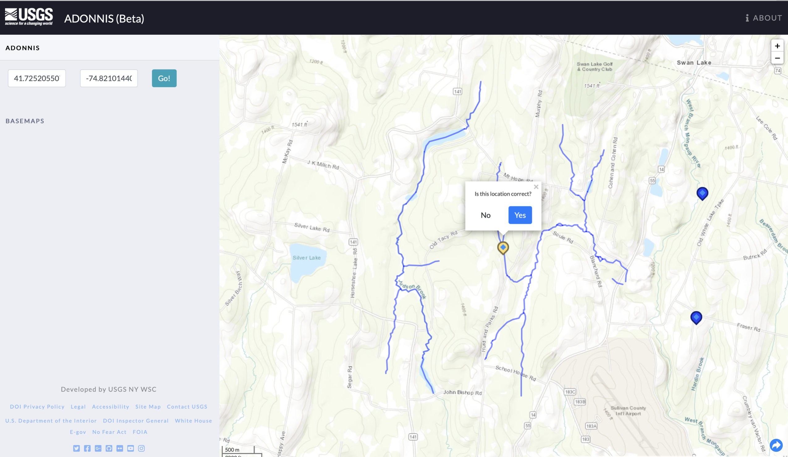

I developed ADONNIS (Automated Downstream Order Naming Numbering Identification System) in a 6 month contract with the USGS. ADONNIS is an internal facing tool designed to automate the task of creating ID numbers for new nation-wide installations of USGS stream gauges.

The USGS stream gauge ID paradigm is based on the relative position of a potential gauge within its drainage basin. The backend of ADONNIS utilized multiple real-world nationwide datasets to perform stream network traversals to discover nearby stream gauges. To accommodate uncertainties in the datasets, the algorithms I developed contained robust error checking and validation systems capable of requesting human verification for critical uncertainties in addition to flagging provable errors in the data.

The completion of this tool allowed the USGS to reduce time spent on ID calculation from the order of full days down to seconds.

