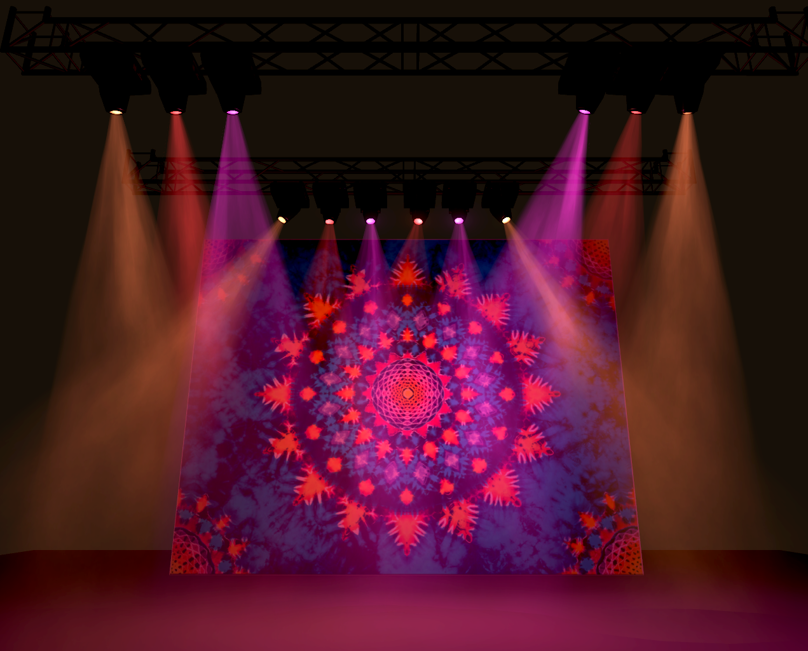

I've been partnering with Telepresent Media to develop a VR live music platform. I'll update this page as the project develops. My current contributions are in visual FX, creative, and UX design for the platform. 

Here is a sneak peak of the stage lighting system I recently finished:

